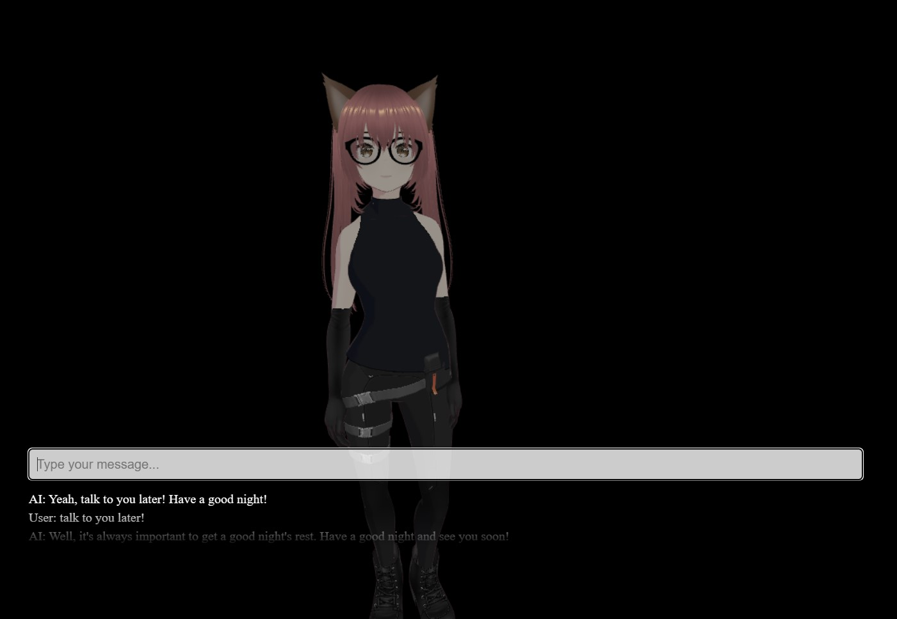

# VRM Chatbot

Yet another LLM + TTS + STT + 3d avatar chatbot application.

This one uses the Upstage.ai Solar API to chat with a VRM 3d avatar.

The application features :
- Upstage.ai Solar LLM integration
- VRM model lip sync (work in progress)
- Coqui XTTSv2 synthesized speech (work in progress)
- Speech-to-text
- LLM controlled actions and expressions

The code is written primarily with :
- Python + Flask for webserver
- Three.js for webgl support
- Pixiv three-vrm VRM support

### Sample UI

If using koboldcpp as a backend:
curl -fLo koboldcpp https://github.com/LostRuins/koboldcpp/releases/latest/download/koboldcpp-linux-x64 && chmod +x koboldcpp
./koboldcpp --model <modelpath>.gguf --port 8000 --gpulayers 75 --contextsize 4096 --skiplauncher --usecublas
